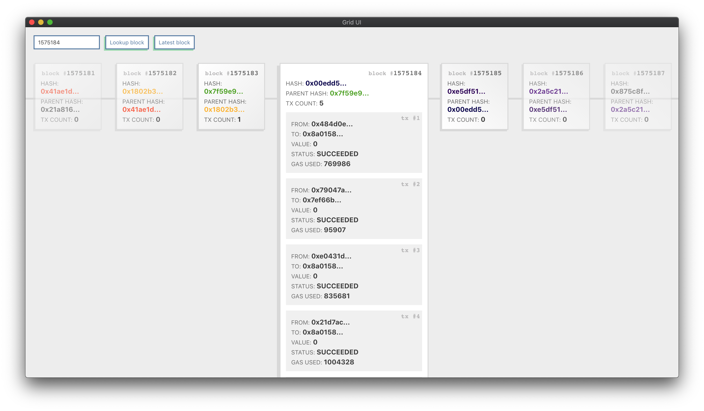

# Grid Workflows

This repository contains examples of Grid workflows.
Each workflow in this repo showcases different API aspects and techniques to achieve advanced.

## Ewasm

### Description
This workflow starts the Ewasm testnet in a Docker container, connects ethers.js to it and requests the `web3_clientVersion` over RPC.

### Concepts:
- Dockerfile in workflow
  - binaries are built using the docker builder pattern
  - docker entry point definition
  - binary as long running service
- FlagBuilder with .docker()


## Block Explorer

### Description
This workflow starts a local Geth instance and configures the GraphQL API using the FlagBuilder.
It then starts the [BlocksApp](https://github.com/marcgarreau/grid-blocks-app) by @marcgarreau which connects over HTTP to Geth.
The Block Explorer can be used to learn more about the blockchain and explore and visualize blocks.
More information available on blog post: ["Ethereum 101: What’s a Blockchain?"](https://medium.com/ethereum-grid/ethereum-101-whats-a-blockchain-5a1e925963d7)

### Screenshots


### Concepts:
- Geth with GraphQL
- Loading a packaged web app
- Connecting a UI directly to a workflow binary over HTTP

## REPL: Read–eval–print loop

### Description
This workflow starts a <**client**> instance.
`client` and `version` are flags that can be passed to the workflow to specify which client. Defaults are `geth` and `latest`.
It configures the RPC API with the FlagBuilder in a client agnostic way and connects ethers.js to it.
Last but not least the workflow enters a loop where it uses Grid's `prompt` API to ask the user for input and execute it as ethers.js commands.
The result is similar to the [JSRE REPL Console](https://github.com/ethereum/go-ethereum/wiki/JavaScript-Console) but with ethers.js and theoretically any client that can open an RPC endpoint.

### Concepts
- `prompt` user for input
- export run function parameter description
- processing of user provided flags: `--client=geth`

### Example Output
```
Grid Version 2.0.0
Grid uses configuration: /Users/philipplgh/Projects/workflows/.grid.config.js 

Starting workflow:
=============================================================
Name: ethers-repl
Version: 1.0.0
Description: This workflow creates Read–eval–print loop (REPL) and executes ethers.js commands on a local Geth instance.
=============================================================
Output:
              
INFO : >> hello repl
INFO : >> run with config { client: 'geth', version: 'latest' }
✔ Found release for: geth - darwin/latest
{
  "name": "geth-alltools-darwin-amd64-1.9.12-unstable-01d92531",
  "version": "1.9.12",
  "displayVersion": "v1.9.12",
  "fileName": "geth-alltools-darwin-amd64-1.9.12-unstable-01d92531.tar.gz",
  "updated_ts": 1582897827000,
  "updated_at": "2020-02-28 13:50:27",
  "size": "61173984",
  "location": "https://gethstore.blob.core.windows.net/builds/geth-alltools-darwin-amd64-1.9.12-unstable-01d92531.tar.gz",
  "remote": false
}
✔ Starting client geth with flags: ["--dev","--rpc","--rpcaddr","127.0.0.1","--rpccorsdomain","localhost:*,127.0.0.1:*"]
INFO : >> Received client version via RPC: Geth/v1.9.12-unstable-01d92531-20200228/darwin-amd64/go1.13.8
INFO : >> ethers.js:  4.0.40
INFO : Type something in this interactive ethers REPL
INFO : Try: ethereum.getNetwork()
> ethereum.getNetwork()
INFO : result: <Promise> =>  { chainId: 1337, name: 'unknown' }
> 
```

## GraphQL Explorer